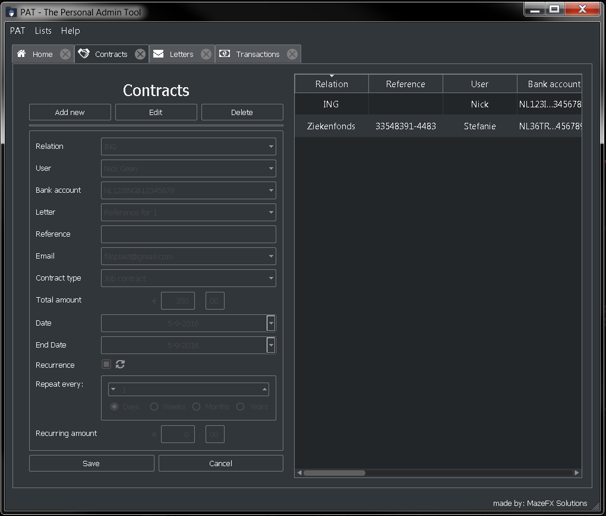
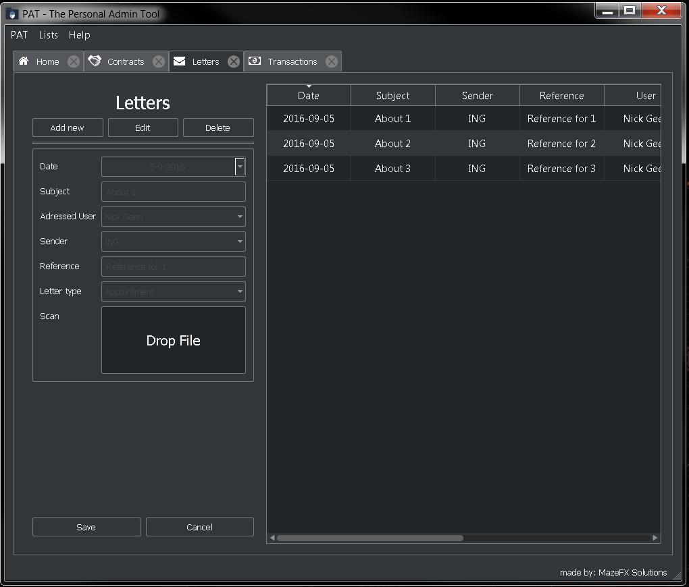
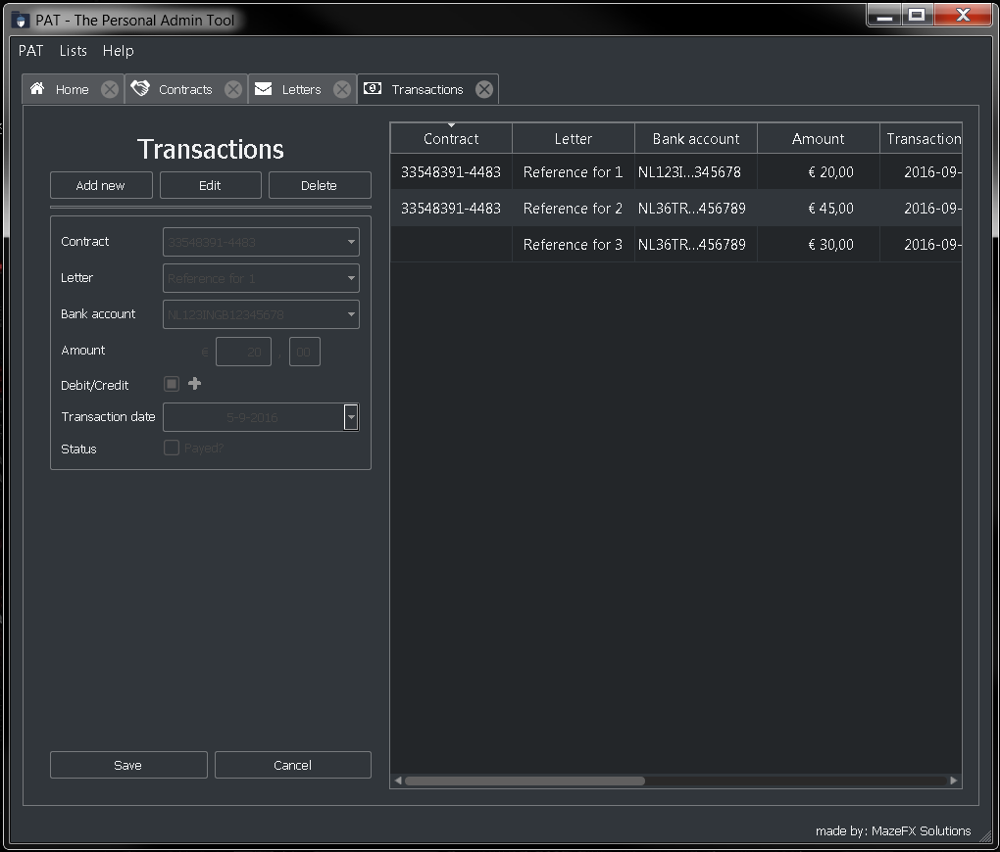

P.A.T.
=================

Personal Admin Tool built with Python and Qt.

For a description I still need to write documentation of what the application does and how it works and needs to be used.

**Personal Note**
First attempt with PyQt and Qt project. Getting to know the framework fast and dirty.

After building a succesfull package with PyInstaller on windows 7 and get a little feeling for Qt it is time to explore the QTest module. See if I can get some unit tests to work properly and then increase the coverage.

Some screenshots for impression.

Contracts screen.

Letters screen.

Transactions screen.

Settings
--------

No settings as of yet.

Test coverage
-------------

Honestly there are no tests still got to write them formulate a test strategy for testing PyQt.

Functional testing:

* Test for adding a letter.

Deployment
----------

Deployment withPyInstaller for making build versions.
In the process of writing an selfexstract installer for easy install on new systems. While recuiting test users it became apparent that it actually needs to be an '1 click install'.

Succesful builds currently not supplied in repo:

* Windows 7 build for 32bit and 64bit.

License and disclaimer
----------------------

This software is released with a buildup of the following licenses:

(Here should come a list or table of all used modules and their license to provide insight into the used licenses)

Current license:
  MIT License Copyright (c) 2016 MazeFX Solutions

.. TODO - Add license.txt file to project

Footnote
--------

| **I want to be a developer!**
|
| Got a job? Like what you see?
| Send me a message, I would love to hear your proposition.

Enjoy your stay on my repository and happy codings!!
